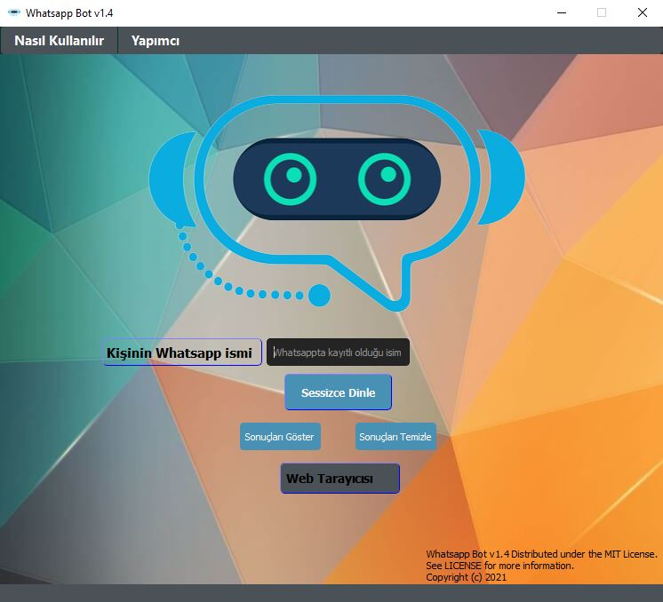

 

  

  <h3 align="center">Whatsapp Kullanıcı Takip v1.2 beta</h3>

  

    Whatsapp Kullanıcı Takip Programı
     
     
    
<address>
      

    <a href="mailto:brktrl@protonmail.ch">Hata Bildir</a>
     
    <!--<a href="http://www.riglsable.rf.gd/" target="_blank">Web Sitesi</a>-->
    

    </address>
    

  

  
<h2 style="display: inline-block">Table of Contents</h2>

  <ol>
    <li>
      <a href="#Program-Hakkında">Program Hakkında</a>
      <ul>
        <li><a href="#Ne-İle-Geliştirildi">Ne İle Geliştirildi</a></li>
      </ul>
    </li>
    <li>
      <a href="#Başlangıç">Başlangıç</a>
      <ul>
        <li><a href="#Kurulum">Kurulum</a></li>
      </ul>
    </li>
    <li><a href="#Kullanım">Kullanış</a></li>
    <li><a href="#Desteklediği-İşletim-Sistemleri">Desteklediği İşletim Sistemleri</a>
    <li><a href="Images">Örnek Resimler</a>
    <li><a href="#lisans">Lisans</a></li>
    <li><a href="#Iletisim">İletişim</a></li>
  </ol>

## Program-Hakkında

**Whatsapp'ınızdaki sohbetlerde kayıtlı olan herhangi bir kişinin,ne zaman aktif olduğunu kaç dakika açık kaldığını size bildiren.Üstelik bunları yaparken çevrimiçi gözükmemeyi de sağlayan bir yazılımdır.**

`BrktrLawliet`,
`brktrl@protonmail.ch`
`Whatsapp Kullanıcı Takip`

### Ne-İle-Geliştirildi

* [PyQt5](https://pypi.org/project/PyQt5/)
* [Python3](https://www.python.org)

## Başlangıç

Kurulumda Windows işletim sistemleri için sadece setup dosyasını indirmeniz yeterli olacaktır.

### Kurulum
0. -Windows-

Windows için mysetup.exe dosyasını indirip klasik bir kurulum dosyası şeklinde kurabilirsiniz.

## Kullanım

Kurma işlemini gerçekleştirdikten sonra sohbetlerinizde bulunan kişinin ismini programdaki ilgili yere yazıp takip etmeyi çalıştırdığınızda sizin seçtiğiniz tarayıcıda whatsapp web açılacaktır.QR Kodu okuttuktan sonra tarayıcınızı ve programınızı aşağıya alıp günlük işlerinize devam edebilirsiniz.Uygulama sizin için log tutmaya devam edecektir.Hiçbir şekilde endişeniz olmasın.Açık kaynak yazılım olduğundan istediğiniz gibi inceleyebilirsiniz uygulamayı.Zararsız olduğunu siz de göreceksiniz.

## Desteklediği-İşletim-Sistemleri
* Windows

## Images
Programın arayüzünden örnek resimler.
</img> 
## lisans

Distributed under the MIT License. See `LICENSE` for more information. 
Copyright (c) 2021 

## Iletisim

E-Mail Adresi:E-Mail - brktrl@protonmail.ch

Proje Linki: [https://github.com/Brktrlw/wptakip](https://github.com/Brktrlw/wptakip) 
<!--Web Site Linki: [http://www.riglsable.rf.gd/](http://www.riglsable.rf.gd/)-->

